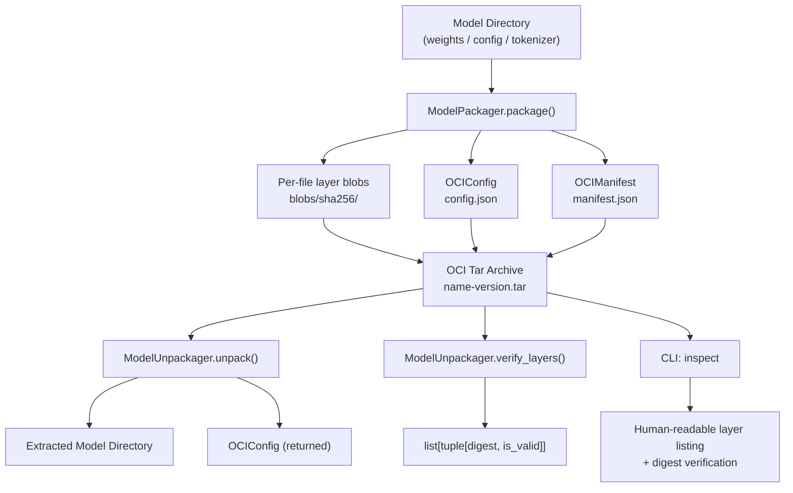

# aumai-modeloci

OCI-compliant packaging for ML models. Package, distribute, and verify machine learning models
using the same container registry infrastructure your team already operates.

[](https://github.com/aumai/aumai-modeloci/actions)
[](https://pypi.org/project/aumai-modeloci/)
[](LICENSE)

---

## What Is This?

Think of your ML models the way Docker thinks about application containers.

When you ship a web service you do not hand a colleague a folder of Python files and say "figure
it out." You build an image, push it to a registry, and they pull it by digest. The image is
immutable, content-addressed, and any OCI-compliant registry can store it.

`aumai-modeloci` brings that same discipline to ML models. It implements the
[OCI Image Specification](https://github.com/opencontainers/image-spec) for model artifacts:

- Every file in your model directory becomes a **content-addressed layer blob** (SHA-256).
- A **manifest** lists every layer with its digest and size — it is a machine-readable bill of
  materials.
- A **config** object carries metadata: name, version, framework, architecture, and arbitrary
  key-value pairs.
- The whole thing lands in a single **portable tar archive** that any OCI registry can ingest.

## Why Does This Matter?

### The problem with ad-hoc model distribution

Most ML teams pass models around in one of three brittle ways:

1. A shared network drive where "latest" means whatever was saved last.
2. A Git LFS commit that balloons the repository and makes `git clone` painful.
3. A cloud storage bucket with opaque paths and no formal versioning contract.

None of these give you cryptographic integrity, reproducible unpacking, or a machine-readable
bill of materials. You cannot tell whether the file was corrupted in transit. You cannot
automate the "is this the model I expect?" check. You cannot integrate with standard registry
tooling.

### OCI as the universal packaging layer

The OCI Image Specification was designed for exactly this problem. By packaging ML models as
OCI artifacts you inherit:

- **Immutability by construction** — the digest *is* the identity; it cannot change post-pack.
- **Registry compatibility** — push/pull with `oras`, `crane`, AWS ECR, GitHub Container
  Registry, or any OCI v1.1-compliant store.
- **Auditability** — the manifest is a machine-readable bill of materials; every blob is
  individually verifiable.
- **Incremental distribution** — future layering allows unchanged blobs to be skipped during
  transfer.

---

## Architecture



### Internal archive layout

```
my-classifier-1.0.0.tar
├── config.json              # Human-readable OCIConfig (convenience copy at root)
├── manifest.json            # OCIManifest with layer descriptors
└── blobs/
    └── sha256/
        ├── a3b9c1d2...      # Gzip-compressed tar of pytorch_model.bin
        ├── f1e2d3c4...      # Gzip-compressed tar of config.json
        ├── 0a1b2c3d...      # Gzip-compressed tar of tokenizer.json
        └── 9e8f7a6b...      # Raw bytes of OCIConfig (as a blob)
```

---

## Features

- OCI Image Manifest schema version 2 compliance
- Per-file layer blobs with gzip compression (`tar+gzip`)
- SHA-256 content addressing for every layer blob
- Cryptographic layer verification — digest re-computation on read
- Path-traversal attack prevention on unpack (Python 3.12+ `filter="data"` with manual
  resolution fallback for older Python)
- Pydantic v2 models for config, manifest, and layers with `model_dump_json` serialization
- Human-readable `config.json` at archive root for convenience tooling
- CLI with `pack`, `unpack`, and `inspect` subcommands
- Framework-agnostic: pytorch, tensorflow, onnx, safetensors, or any string label

---

## Installation

```bash
pip install aumai-modeloci
```

**Requirements:** Python 3.11+

---

## Quick Start

### 1. Pack a model directory

```bash
aumai-modeloci pack \
  --model-dir ./my-model \
  --name my-classifier \
  --version 1.0.0 \
  --framework pytorch \
  --architecture transformer
```

Output:

```
Packaged model: /workspace/my-classifier-1.0.0.tar
  Name        : my-classifier
  Version     : 1.0.0
  Framework   : pytorch
  Archive     : /workspace/my-classifier-1.0.0.tar
```

### 2. Inspect without extracting

```bash
aumai-modeloci inspect --archive my-classifier-1.0.0.tar
```

```
Model    : my-classifier
Version  : 1.0.0
Framework: pytorch
Arch     : transformer

Layers (3):
  pytorch_model.bin                        4321.0 KB  sha256:a3b9c1d2e4f5...
  config.json                                 2.1 KB  sha256:f1e2d3c4b5a6...
  tokenizer.json                             18.4 KB  sha256:0a1b2c3d4e5f...

Layer verification (3 layers):
  OK  sha256:a3b9c1d2e4f5...
  OK  sha256:f1e2d3c4b5a6...
  OK  sha256:0a1b2c3d4e5f...
All layers verified.
```

### 3. Unpack an archive

```bash
aumai-modeloci unpack \
  --archive my-classifier-1.0.0.tar \
  --output ./unpacked-model
```

---

## CLI Reference

### `aumai-modeloci pack`

Package a model directory into an OCI-compliant tar archive.

The output archive is written to the parent directory of `--model-dir` with the filename
`<name>-<version>.tar`.

| Option | Required | Default | Description |
|--------|----------|---------|-------------|
| `--model-dir PATH` | yes | — | Directory containing model files |
| `--name TEXT` | yes | — | Model name |
| `--version TEXT` | yes | — | Version string (semver recommended) |
| `--framework TEXT` | no | `pytorch` | Framework tag (pytorch, tensorflow, onnx, …) |
| `--architecture TEXT` | no | `transformer` | Architecture description |
| `--metadata JSON` | no | `{}` | Arbitrary extra metadata as a JSON string |

**Example with rich metadata:**

```bash
aumai-modeloci pack \
  --model-dir ./llama-finetune \
  --name llama-customer-support \
  --version 2.1.3 \
  --framework pytorch \
  --architecture transformer \
  --metadata '{"base_model":"llama-3-8b","dataset":"cs-v2","accuracy":0.91}'
```

### `aumai-modeloci unpack`

Extract an OCI archive and print the model config.

| Option | Required | Description |
|--------|----------|-------------|
| `--archive PATH` | yes | Path to the `.tar` archive |
| `--output PATH` | yes | Destination directory (created if absent) |

### `aumai-modeloci inspect`

Read and display archive contents without extracting. Verifies all layer digests.

| Option | Required | Description |
|--------|----------|-------------|
| `--archive PATH` | yes | Path to the `.tar` archive |

Exits with code 1 if any layer fails digest verification.

---

## Python API

### Packing a model

```python
from aumai_modeloci.core import ModelPackager
from aumai_modeloci.models import OCIConfig

config = OCIConfig(
    model_name="bert-sentiment",
    version="3.0.0",
    framework="pytorch",
    architecture="transformer",
    metadata={"task": "sentiment-analysis", "language": "en"},
)

packager = ModelPackager()
archive_path = packager.package("/path/to/bert-sentiment", config)
print(f"Archive: {archive_path}")
```

### Unpacking and reading the config

```python
from aumai_modeloci.core import ModelUnpackager

unpacker = ModelUnpackager()
config = unpacker.unpack("bert-sentiment-3.0.0.tar", "/tmp/bert-out")
print(config.model_name, config.version, config.framework)
```

### Verifying layer integrity

```python
from aumai_modeloci.core import ModelUnpackager

unpacker = ModelUnpackager()
results = unpacker.verify_layers("bert-sentiment-3.0.0.tar")

for digest, is_valid in results:
    status = "OK" if is_valid else "CORRUPTED"
    print(f"{status}  {digest}")

if not all(valid for _, valid in results):
    raise RuntimeError("Archive integrity check failed")
```

### Building a manifest from existing layers

```python
from aumai_modeloci.core import ModelPackager
from aumai_modeloci.models import ModelLayer, OCIConfig

config = OCIConfig(
    model_name="onnx-detector",
    version="1.0.0",
    framework="onnx",
    architecture="cnn",
)

layers = [
    ModelLayer(
        digest="sha256:abc123...",
        size=1_048_576,
        annotations={"org.opencontainers.image.title": "model.onnx"},
    ),
]

packager = ModelPackager()
manifest = packager.create_manifest(config, layers)
print(manifest.model_dump_json(indent=2))
```

### Adding a layer to an existing archive

```python
from aumai_modeloci.core import ModelPackager

packager = ModelPackager()
layer = packager.add_layer("my-model-1.0.0.tar", "/path/to/extra-vocab.json")
print(f"Added layer: {layer.digest}  ({layer.size} bytes)")
```

---

## Configuration Reference

### `OCIConfig` fields

| Field | Type | Required | Description |
|-------|------|----------|-------------|
| `model_name` | `str` | yes | Human-readable model name |
| `version` | `str` | yes | Version string |
| `framework` | `str` | yes | ML framework label |
| `architecture` | `str` | yes | Architecture family |
| `metadata` | `dict[str, Any]` | no | Arbitrary key-value metadata |

### `ModelLayer` fields

| Field | Type | Default | Description |
|-------|------|---------|-------------|
| `digest` | `str` | — | `sha256:<hex>` content digest |
| `size` | `int` | — | Blob size in bytes |
| `media_type` | `str` | `application/vnd.oci.image.layer.v1.tar+gzip` | OCI media type |
| `annotations` | `dict[str, str]` | `{}` | OCI annotations (used for `org.opencontainers.image.title`) |

### `OCIManifest` fields

| Field | Type | Default | Description |
|-------|------|---------|-------------|
| `schema_version` | `int` | `2` | OCI schema version |
| `media_type` | `str` | `application/vnd.oci.image.manifest.v1+json` | OCI manifest media type |
| `config` | `dict[str, Any]` | — | Config descriptor (digest, size, mediaType) |
| `layers` | `list[dict[str, Any]]` | `[]` | Layer descriptors |

---

## How It Works

### Layer creation

Each file in the model directory becomes an independent layer blob:

1. The file is compressed into an in-memory `tar.gz` byte buffer.
2. SHA-256 of that buffer is computed — this becomes both the blob's storage filename and its
   OCI digest (`sha256:<hex>`).
3. The buffer is written to `blobs/sha256/<hex>`.
4. A `ModelLayer` descriptor records the digest, size, and `org.opencontainers.image.title`
   annotation containing the relative path.

### Manifest construction

After all file layers are created, a config blob is written. Then `OCIManifest` is assembled
with a config descriptor (pointing at the config blob) and a layer descriptor list. The manifest
is serialized to `manifest.json` at the archive root.

### Verification

`ModelUnpackager.verify_layers` parses the manifest, locates each layer blob by its digest path,
reads its bytes, recomputes SHA-256, and compares with the stored digest. Any mismatch indicates
corruption or tampering after the pack step.

### Path-traversal safety

On Python 3.12+ `tarfile.extractall` is called with `filter="data"` which rejects absolute
paths and `..` components at the C level. On older Python the code manually resolves every
member path and confirms it stays inside the output directory before calling `extractall`.

---

## Integration with Other AumAI Projects

| Project | Integration |
|---------|-------------|
| **aumai-specs** | Define `OCIConfig` contracts as specs; validate at pack time |
| **aumai-greenai** | Embed estimated inference energy in `OCIConfig.metadata` at pack time |
| **aumai-confidentialrag** | Package encrypted RAG index artifacts as versioned OCI archives |

---

## Contributing

See [CONTRIBUTING.md](CONTRIBUTING.md). All contributions require passing `make lint` (ruff +
mypy strict) and `make test` (pytest). Use conventional commit messages:
`feat:`, `fix:`, `refactor:`, `docs:`, `test:`, `chore:`.

## License

Apache 2.0 — see [LICENSE](LICENSE).
